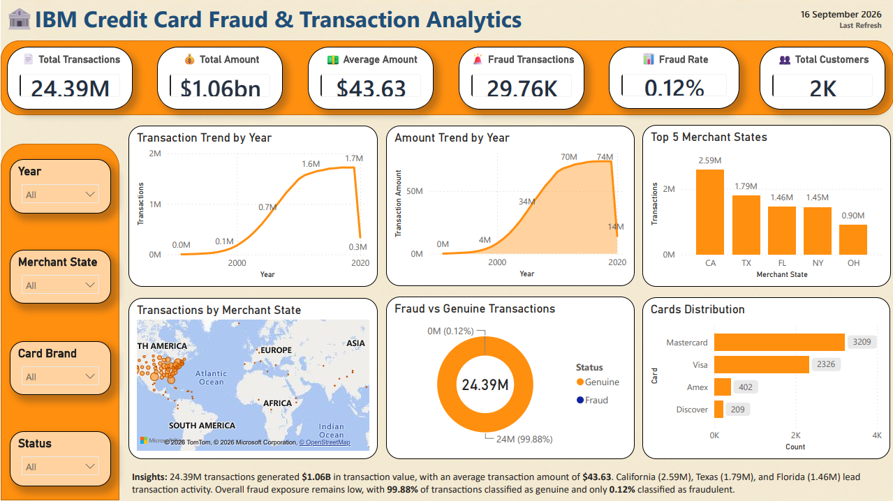
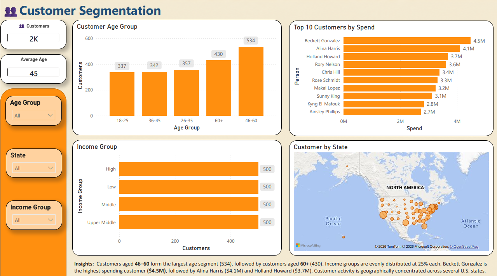
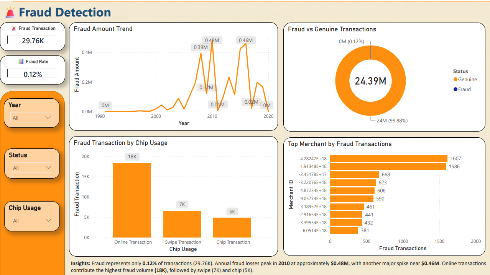
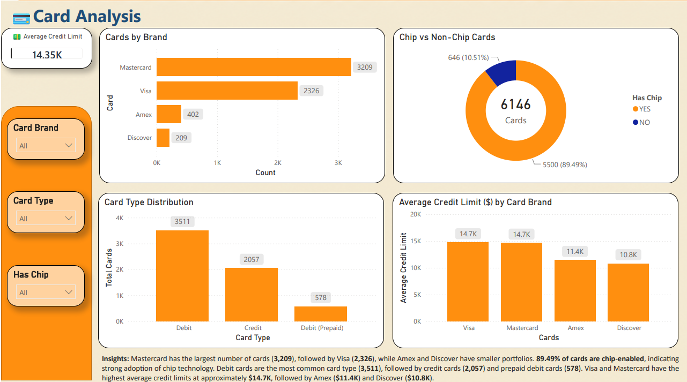
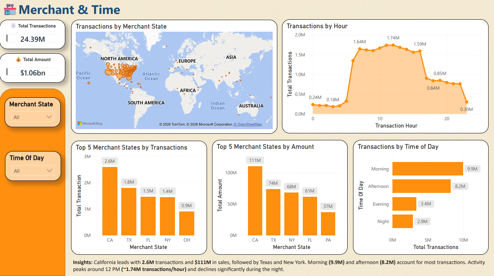

# 💳 IBM Credit Card Fraud & Transaction Analytics

End-to-end Credit Card Fraud and Transaction Analytics project using **Python, SQL Server, and Power BI**. It includes data cleaning, feature engineering, Data Modelling, EDA, and interactive dashboards to analyze credit card transactions, customer behavior, card characteristics, merchant activity, time-based patterns, and fraud risk that support data-driven decision-making.

---

## 📌 Project Overview

The objective was to transform raw transactional data into meaningful insights that help understand credit card transactions, customer behavior, card characteristics, merchant activity, time-based patterns, and fraud risk that support data-driven decision-making.

### Objectives

- Analyze transaction volume and transaction value
- Measure fraud transactions and fraud rate
- Understand customer demographics and spending behavior
- Analyze card brands, card types, chip usage, and credit limits
- Identify high-volume merchant states
- Analyze transaction activity by hour and time of day
- Build an interactive Power BI dashboard
- Apply SQL aggregation and optimization for large-scale data

---

## 📂 Dataset

**Source**: IBM Credit Card Fraud Detection dataset, downloaded from Kaggle.

**Link**: https://www.kaggle.com/code/yichenzhang1226/ibm-credit-card-fraud-detection-eda-random-forest/input

**Note**: The raw and cleaned transaction data are **not included in this repository** because the transaction dataset is approximately **5.6** GB.

The project uses multiple datasets including:
- userss
- cards
- credit card transactions
These datasets were cleaned using Python before loading into SQL Server.

---

## 🛠 Tech Stack

| Tool | Purpose |
|---|---|
| **Python** | Data exploration, cleaning, preprocessing, and feature preparation |
| **Pandas / NumPy** | Data manipulation and transformation |
| **SQL Server** | Data storage, modeling, aggregation, indexing, KPIs, and reporting views |
| **T-SQL** | Database objects, queries, KPIs, indexes, and views |
| **Power BI** | Data modeling, DAX measures, Semantic model, interactive visuals, slicers, and dashboard design |

---

## 🗄 Database Design

The SQL Server database uses a fact-and-dimension structure.

Dimension Tables
- dim_users
- dim_cards

Fact Table
- fact_transactions

---

## 🧩 Data Modeling

### SQL Server

The underlying SQL Server design uses a fact-and-dimension structure:

```text
dim_users              dim_cards
     \                    /
      \                  /
       \                /
        fact_transactions
        ~24.39M rows
```

- **`fact_transactions`** stores transaction-level data.
- **`dim_users`** stores customer information.
- **`dim_cards`** stores card information.

### Power BI

The Power BI semantic model uses the required relationships between dimensions and reporting views to support interactive filtering while keeping the large transaction fact table outside the Power BI import model.

--- 

## 🔄 Data Flow

```text
IBM Credit Card Fraud & Transaction Dataset
                ↓
         Python Cleaning (Pandas)
                ↓
           Cleaned Data
                ↓
            SQL Server
                ↓
      Staging & Bulk Insertion
                ↓
      Fact & Dimension Tables
                ↓
      Indexing & SQL Analysis
                ↓
       KPI & Reporting Views
                ↓
            Power BI
                ↓
       Interactive Dashboard
                ↓
        Business Insights
```

---

## 🧹 Data Preparation & Cleaning

Python was used to prepare the data before loading it into SQL Server.

Key preparation activities included:

- Data exploration
- Missing-value checks
- Duplicate checks
- Data-type conversion
- Inconsistent-value handling
- Data validation
- Feature preparation
- Export of cleaned datasets

---

## 📊 Power BI Dashboard

The final report contains five analytical pages.

### 1️⃣ Executive Overview



Provides a high-level summary of the banking transaction portfolio using key KPIs and trends.

- Total Transactions
- Total Transaction Amount
- Average Transaction Amount
- Fraud Transactions
- Fraud Rate
- Customer Overview
- Transaction Trends
- Merchant and card overview

#### 📈 Key Performance Indicators (KPIs)

| Metric | Value |
|---|---:|
| Total Transactions | **24.39M** |
| Total Transaction Amount | **$1.06B** |
| Average Transaction Amount | **$43.63** |
| Fraud Transactions | **29.76K** |
| Fraud Rate | **0.12%** |
| Total Customers | **~2K** |

---

### 2️⃣ Customer Segmentation



Analyzes customer demographics, spending behavior, and geographic distribution.

- Customer age groups
- Income groups
- Top customers by spend
- Customer geographic distribution
- Customer transaction activity

Key Observation:
- The 46–60 age group is the largest customer age segment with 534 customers.

---

### 3️⃣ Fraud Detection



Analyzes fraud frequency, fraud amount, transaction channels, and merchant-level fraud activity.

- Fraud amount trend
- Fraud vs genuine transactions
- Fraud by chip usage
- Top merchants by fraud amount
- Top merchants by fraud transactions

Key Observation:
- Fraud represents approximately 0.12% of total transactions.
- Approximately 99.88% of transactions are classified as genuine.

---

### 4️⃣ Card Analysis



Analyzes card portfolio composition and credit characteristics.

- Cards by brand
- Chip vs non-chip cards
- Card type distribution
- Average credit limit
- Average credit limit by card brand

Key Observations: 
- Mastercard has the largest card portfolio with 3,209 cards.
- Visa follows with 2,326 cards.
- 89.49% of cards are chip-enabled.
- Debit cards are the most common card type with 3,511 cards.
- Overall average credit limit is approximately $14.35K.

---

### 5️⃣ Merchant & Time



Analyzes merchant activity by geography and transaction timing.

- Merchant transaction distribution
- Top merchant states by transactions
- Top merchant states by sales
- Transactions by hour
- Transactions by time of day

Key Observations:
- California leads with approximately 2.59M transactions and $111M in sales.
- Morning and afternoon account for the largest transaction volumes.
- Transaction activity peaks around the late-morning to early-afternoon period.

---

## 🔍 Key Findings

- 24.39M transactions were analyzed, with total transaction value of approximately $1.06B and an average transaction amount of $43.63.
- 29.76K transactions were fraudulent, representing a 0.12% fraud rate, while 99.88% were classified as genuine.
- California leads merchant activity with approximately 2.59M transactions and $111M in sales.
- Mastercard has the largest card portfolio (3,209 cards), followed by Visa (2,326); 89.49% of cards are chip-enabled.
- Debit cards are the most common card type (3,511 cards).
- The 46–60 age group is the largest customer segment with 534 customers.
- Transaction activity is concentrated during morning and afternoon, with the highest hourly activity around 11 AM–1 PM.
- In the fraud analysis, online transactions show the highest fraud volume among the displayed transaction channels.

---
## 💡 Recommendations

- Strengthen authentication and fraud monitoring for online transactions, given their higher observed fraud volume.
- Increase monitoring during historically high-fraud periods and peak transaction hours.
- Prioritize operational and monitoring capacity in high-volume merchant states, particularly California and Texas.
- Continue promoting chip-enabled cards and assess non-chip cards for potential upgrades.
- Use customer age, income, and spending behavior to support targeted customer and product strategies.
- Apply additional merchant-level monitoring to merchants contributing disproportionately to fraud amount or fraud transactions.
- Maintain appropriate credit-limit monitoring for card segments with higher average limits.

---

## 🚀 Future Improvements

- Real-time transaction monitoring
- Fraud prediction using Machine Learning
- Customer churn prediction
- Fraud risk scoring
- Cloud deployment using Azure
- Automated Power BI refresh pipeline

--- 

## 🎯 Skills Demonstrated

- Data Cleaning
- Data Analysis
- Python & Pandas
- SQL Query Writing
- Database Design
- Data Modeling
- SQL Optimization
- PI Development
- Power BI Dashboard Development
- DAX
- Business Intelligence
- Data Visualization
- Insight Generation

---

## ⚡ Performance Approach

The transaction fact table contains approximately **24.39M records (~5.6 GB)**. Instead of importing the full fact table into Power BI, the project performs heavy aggregation in SQL Server and imports lightweight reporting views.

```text
24.39M transaction rows
        ↓
SQL Server aggregation
        ↓
Reporting views
        ↓
Power BI import
```

This approach reduces the amount of data handled directly by Power BI while retaining the information required for the dashboard.

---

## 📁 Repository Structure

```text
IBM-Credit-Card-Fraud-Transaction-Analytics/
│
├── README.md
│
├───01_Dataset
│   ├───01_Raw_Data
│   └───02_Cleaned_Data
├───02_Python
├───03_SQL
│   ├───01_Database_Creation
│   ├───02_Staging Table & Bulk Insertation
│   ├───03_Dimension_Table
│   ├───04_Indexing
│   ├───05_KPIs
│   │   ├───01_Executive
│   │   ├───02_Customer
│   │   ├───03_Cards
│   │   ├───04_Fraud
│   │   ├───05_Time
│   │   └───06_Merchant
│   └───06_Views
├───04_Power BI
└───05_Assets
```

---

## 👨‍💻 Author

**Deep Kumar**

## ⭐ If you found this project useful, consider giving it a Star.

---
